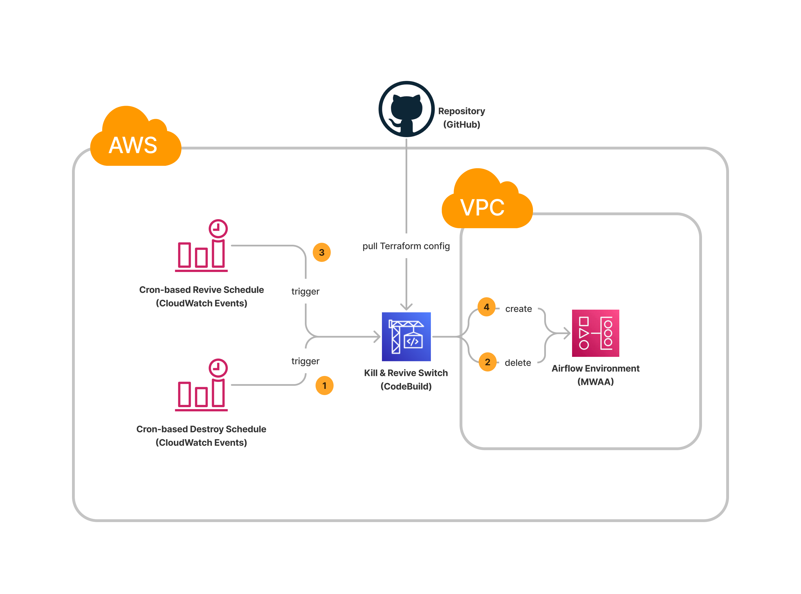

## MWAA Use Case Example

environment directory contains MWAA infrastructure IaC that will be used to be spun up and down.

killswitch directory utilizes the killswitch root module of this repository.

# Architecture

# Usage

Before creating the MWAA infrastructure, specify the s3 backend for your remote state file.